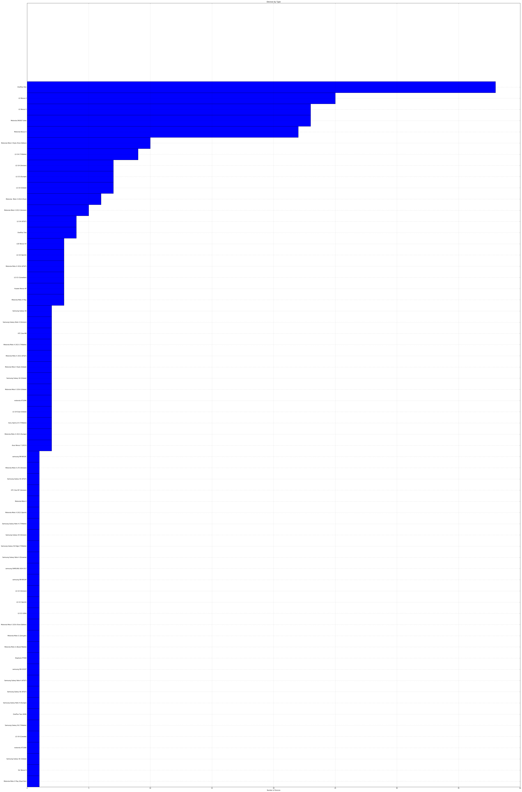
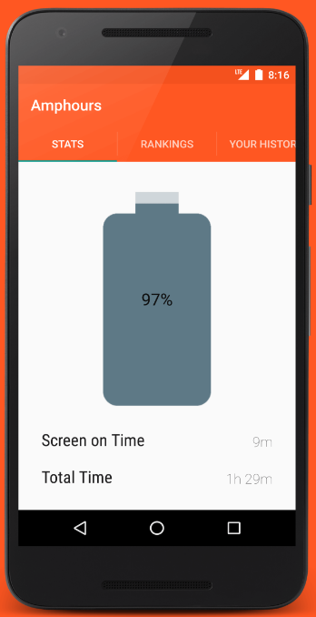

# An Amphours Postmortem

I built the backend for Amphours, the first battery benchmark tailored towards real world use. 

A few days ago my partner [Ming](https://github.com/ming08108?tab=overview&from=2016-08-01&to=2016-08-31&utf8=%E2%9C%93) finally decided to not renew the .xyz domain (Send all hate mail to him). 


But before I say goodbye, I'd like to showcase the data we collected over the course of ~1 year before we all switched to iOS. 


# Grabbing the Data


Amphours was built with 2 collections in MongoDB - one for unique devices, and one for statistics read-outs. 

First, lets grab some data from both MongoDB instances. 


`$ mongoexport -h secret_DB.db_host.com:231337 -d amphours -c statistics -u username -p pass -o statistics.json --jsonArray`

=> 63 records

`$ mongoexport -h secret_DB.db_host.com:231337 -d amphours -c devices -u username -p pass -o devices.json --jsonArray`

=> 54881 records

Let's load it up. 


```python
import json 
from pprint import pprint
import pandas as pd

with open('devices.json') as devices_raw: 
    devices = json.load(devices_raw)

with open('statistics.json') as statistics_raw: 
    statistics = json.load(statistics_raw)
    
# Print out the last few
print "Devices"
dev_df = pd.DataFrame(devices)
dev_df.head() 


```

    Devices
    


<div>
<table border="1" class="dataframe">
  <thead>
    <tr style="text-align: right;">
      <th></th>
      <th>_id</th>
      <th>count</th>
      <th>friendlyname</th>
      <th>name</th>
      <th>rank</th>
      <th>sot</th>
      <th>standby</th>
      <th>uniquedevices</th>
    </tr>
  </thead>
  <tbody>
    <tr>
      <th>0</th>
      <td>{u'$oid': u'57649f238b09bce65c43c7bb'}</td>
      <td>38</td>
      <td>Asus Nexus 7 (2013)</td>
      <td>asus Nexus 7</td>
      <td>1</td>
      <td>{u'$numberLong': u'41976548'}</td>
      <td>{u'$numberLong': u'154386092'}</td>
      <td>2</td>
    </tr>
    <tr>
      <th>1</th>
      <td>{u'$oid': u'57649f238b09bce65c43c7bc'}</td>
      <td>75</td>
      <td>Motorola Moto X 2013 (Europe)</td>
      <td>motorola XT1052</td>
      <td>2</td>
      <td>{u'$numberLong': u'36933090'}</td>
      <td>{u'$numberLong': u'63887738'}</td>
      <td>2</td>
    </tr>
    <tr>
      <th>2</th>
      <td>{u'$oid': u'57649f238b09bce65c43c7bd'}</td>
      <td>661</td>
      <td>Motorola Moto X Style (Pure Edition)</td>
      <td>motorola XT1575</td>
      <td>3</td>
      <td>{u'$numberLong': u'32610548'}</td>
      <td>{u'$numberLong': u'39241215'}</td>
      <td>10</td>
    </tr>
    <tr>
      <th>3</th>
      <td>{u'$oid': u'57649f238b09bce65c43c7be'}</td>
      <td>26</td>
      <td>Motorola Moto X Play (Dual Sim)</td>
      <td>motorola XT1563</td>
      <td>4</td>
      <td>{u'$numberLong': u'28520250'}</td>
      <td>{u'$numberLong': u'56976157'}</td>
      <td>1</td>
    </tr>
    <tr>
      <th>4</th>
      <td>{u'$oid': u'57649f238b09bce65c43c7bf'}</td>
      <td>31</td>
      <td>htc Nexus 9</td>
      <td>htc Nexus 9</td>
      <td>5</td>
      <td>{u'$numberLong': u'26562915'}</td>
      <td>{u'$numberLong': u'158680537'}</td>
      <td>1</td>
    </tr>
  </tbody>
</table>
</div>


```python
print "Statistics"
stat_df = pd.DataFrame(statistics)
stat_df.head() 
```

    Statistics
    


<div>
<table border="1" class="dataframe">
  <thead>
    <tr style="text-align: right;">
      <th></th>
      <th>_id</th>
      <th>date</th>
      <th>device</th>
      <th>friendlyname</th>
      <th>sot</th>
      <th>total</th>
      <th>used</th>
      <th>uuid</th>
      <th>version</th>
    </tr>
  </thead>
  <tbody>
    <tr>
      <th>0</th>
      <td>{u'$oid': u'55ebccdfb94be457b7f38c2c'}</td>
      <td>{u'$numberLong': u'1441516699'}</td>
      <td>LGE LG-H811</td>
      <td>LGE LG-H811</td>
      <td>{u'$numberLong': u'284368'}</td>
      <td>{u'$numberLong': u'3718542'}</td>
      <td>3</td>
      <td>bc39765e-005d-4ecc-beb0-8eeb46e5edd5</td>
      <td>22</td>
    </tr>
    <tr>
      <th>1</th>
      <td>{u'$oid': u'55ec6235b94be457b7f38c2d'}</td>
      <td>{u'$numberLong': u'1441554929'}</td>
      <td>LGE LG-H811</td>
      <td>LGE LG-H811</td>
      <td>{u'$numberLong': u'1832653'}</td>
      <td>{u'$numberLong': u'38208845'}</td>
      <td>37</td>
      <td>bc39765e-005d-4ecc-beb0-8eeb46e5edd5</td>
      <td>22</td>
    </tr>
    <tr>
      <th>2</th>
      <td>{u'$oid': u'55ec77c7b94be457b7f38c2e'}</td>
      <td>{u'$numberLong': u'1441560451'}</td>
      <td>LGE LG-H811</td>
      <td>LGE LG-H811</td>
      <td>{u'$numberLong': u'197945'}</td>
      <td>{u'$numberLong': u'1963997'}</td>
      <td>4</td>
      <td>bc39765e-005d-4ecc-beb0-8eeb46e5edd5</td>
      <td>22</td>
    </tr>
    <tr>
      <th>3</th>
      <td>{u'$oid': u'55ec8426b94be457b7f38c34'}</td>
      <td>{u'$numberLong': u'1441563617'}</td>
      <td>LGE LG-H811</td>
      <td>LGE LG-H811</td>
      <td>{u'$numberLong': u'245544'}</td>
      <td>{u'$numberLong': u'2199522'}</td>
      <td>4</td>
      <td>bc39765e-005d-4ecc-beb0-8eeb46e5edd5</td>
      <td>22</td>
    </tr>
    <tr>
      <th>4</th>
      <td>{u'$oid': u'55ec88f6b94be457b7f38c37'}</td>
      <td>{u'$numberLong': u'1441564849'}</td>
      <td>LGE LG-H811</td>
      <td>LGE LG-H811</td>
      <td>{u'$numberLong': u'6059'}</td>
      <td>{u'$numberLong': u'6091'}</td>
      <td>0</td>
      <td>bc39765e-005d-4ecc-beb0-8eeb46e5edd5</td>
      <td>22</td>
    </tr>
  </tbody>
</table>
</div>


# Devices

From the start, our strategy for Amphours was to start small on several different Android phone specific subreddits.  


```python
print len(devices)
```

    63
    

We got 63 different types! Yowza. Didn't expect that. 

(Though in fairness, most major manufacturers come up as different units because of region locking and carriers)

Here's the distribution of users with these devices in an inappropriately large bar graph:


```python
%matplotlib inline

from pylab import *

# Get # of uniques per device 

sorted_devices = sorted(devices, key=lambda device: device['uniquedevices'])

names = [device['friendlyname'] for device in sorted_devices]
uniques = [device['uniquedevices'] for device in sorted_devices]

figure(figsize=(len(names), 100))
pos = arange(len(names))+  0.5    # the bar centers on the y axis

barh(pos, uniques, align='center', height=1)
yticks(pos, tuple(names))
xlabel('Number of Devices')
title('Devices by Type')
grid(True)


show()
```





Our efforts on /r/OnePlus were far and away the most successful, though more with the PlusOne than the PlusTwo. 


The most surprising result is the Droid Turbo - we don't even know anybody with a Droid Turbo. 


# Statistics 

Next lets dive into the statistics. 

Who has the most battery life?

First, lets find out how much "fluff" data we have. We can do that by removing all of the 0-used elements, which yield completely absurd predictions.  


```python
zero_values = filter(lambda stat: stat['used'] == 0, statistics)

print "Number of stats", len(statistics)
print "Number of zeros", len(zero_values)
print "Number of non-zeroes", len(statistics) - len(zero_values)
```

    Number of stats 54881
    Number of zeros 41175
    Number of non-zeroes 13706
    

Lets filter these further to get where all have at least 20% battery used, which is the threshold used in the ranking process. 


```python
THRESHOLD = 20

thresholded_values = filter(lambda stat: stat['used'] > THRESHOLD, statistics)

print "Tresholded values", len(thresholded_values)
```

    Tresholded values 7211
    

Now we have 7211 statistics to work with. 


```python
import datetime

# Lets find the total first 
sorted_statistics_total = sorted(thresholded_values, key=lambda stat: int(stat['total']['$numberLong']))
sorted_statistics_sot = sorted(thresholded_values, key=lambda stat: int(stat['sot']['$numberLong']))

total_time = int(sorted_statistics_total[-1]['total']['$numberLong'])
sot_time = int(sorted_statistics_sot[-1]['sot']['$numberLong'])

print str(datetime.timedelta(milliseconds=total_time))
print str(datetime.timedelta(milliseconds=sot_time))
```

    40 days, 0:30:03.049000
    40 days, 0:11:22.334000
    

There are some clear outliers here - the highest value lasts *16718 days*. 

However, if we slide a few spaces down, we get more reasonable high bar. 


```python
device_150 = sorted_statistics_total[-150]

total_time = int(device_150['total']['$numberLong'])
sot_time = int(device_150['sot']['$numberLong'])

print device_150['friendlyname']
print str(datetime.timedelta(milliseconds=total_time))
print str(datetime.timedelta(milliseconds=sot_time))
```

    HTC One (M8)
    1 day, 2:50:17.299000
    1:55:00.848000
    

Yeah, that's better and aligns with my own use.

Now lets apply some outlier detection to this set of data. 


```python
import numpy as np
import pandas as pd 
from sklearn import svm

def get_outliers(values): 
    # Shuffle the thresholded data 
    np.random.shuffle(values)

    # Get training data 
    X = [[
            int(stat['total']['$numberLong']), 
            int(stat['sot']['$numberLong']), 
            int(stat['used'])
         ] for stat in values]
    Y = [stat['uuid'] for stat in values]


    # fit the model
    guesstimate = 0.1 # Lets estimate 10% novelty rate

    clf = svm.OneClassSVM(kernel="linear", nu=guesstimate)
    clf.fit(X)
    scores = clf.decision_function(X)    
    probs = clf.predict(X)
    
    
    
    results = []
    
    
    idx = 0
    outliers = 0 

    for score in scores:        
        if score < 0: 
            outliers += 1

            outlier = values[idx]
            total_time = int(outlier['total']['$numberLong'])
            sot_time = int(outlier['sot']['$numberLong'])

            total = str(datetime.timedelta(milliseconds=total_time))
            sot = str(datetime.timedelta(milliseconds=sot_time))
            results.append([outlier['uuid'], outlier['friendlyname'], sot, total,  outlier['used']]); 
        idx += 1
    return results
```

For this, lets use a OneClassSVM for anomaly/novelty detection. 


```python
THRESHOLD = 20
thresholded_values = filter(lambda stat: stat['used'] > THRESHOLD, statistics)

results = get_outliers(thresholded_values)

result_df = pd.DataFrame(results)
result_df.columns = ['UUID', 'Device', 'SOT', 'Total', 'Used']

print "Outliers: %d,\t %f of dataset" % (len(results), 1.0 * outliers/len(thresholded_values))

result_df.head()
```

    Outliers: 722,	 0.100125 of dataset
    


<div>
<table border="1" class="dataframe">
  <thead>
    <tr style="text-align: right;">
      <th></th>
      <th>UUID</th>
      <th>Device</th>
      <th>SOT</th>
      <th>Total</th>
      <th>Used</th>
    </tr>
  </thead>
  <tbody>
    <tr>
      <th>0</th>
      <td>98a358ea-174a-46bb-ae64-371f8da32711</td>
      <td>LGE LG G3</td>
      <td>0:35:59.440000</td>
      <td>1:16:30.922000</td>
      <td>21</td>
    </tr>
    <tr>
      <th>1</th>
      <td>de702b52-b09a-407e-bba1-c79535f8dbe0</td>
      <td>Samsung Galaxy Note4</td>
      <td>0:51:15.342000</td>
      <td>1:03:00.743000</td>
      <td>23</td>
    </tr>
    <tr>
      <th>2</th>
      <td>d8864b30-1760-4d0a-9176-ad0eaf9af242</td>
      <td>LGE LGLS991</td>
      <td>1:35:26.451000</td>
      <td>1:59:26.728000</td>
      <td>49</td>
    </tr>
    <tr>
      <th>3</th>
      <td>62b7e82d-ea57-4b93-b085-b7fea19ae1a3</td>
      <td>LGE Nexus 5X</td>
      <td>0:13:12.085000</td>
      <td>1:35:05.322000</td>
      <td>22</td>
    </tr>
    <tr>
      <th>4</th>
      <td>7b188bcf-9b53-464f-9804-b4c169aeaa6c</td>
      <td>Motorola DROID Turbo</td>
      <td>1:32:09.439000</td>
      <td>2:13:42.607000</td>
      <td>29</td>
    </tr>
  </tbody>
</table>
</div>


Our guesstimate is critical to getting good results here - by estimating 10% error with the SVM nu parameter, we get a few anomalous results. 

One can be seen here immediately - ~1hr of SOT and total use implies a 0 hour standby time, which is certainly strange. The same pattern can be observed throughout the list. 


Next, lets see if we can find similar anomalies in the data for another device - say, the OnePlusOne. 


```python
opo_stats = [value for value in thresholded_values if value['friendlyname'] == 'OnePlus One']


opo_results = get_outliers(opo_stats)

opo_results_df = pd.DataFrame(opo_results)
opo_results_df.columns = ['UUID', 'Device', 'SOT', 'Total', 'Used']

print "Outliers: %d,\t %f of dataset" % (len(opo_results), 1.0 * len(opo_results)/len(opo_stats))

opo_results_df.head()
```

    Outliers: 69,	 0.101471 of dataset
    


<div>
<table border="1" class="dataframe">
  <thead>
    <tr style="text-align: right;">
      <th></th>
      <th>UUID</th>
      <th>Device</th>
      <th>SOT</th>
      <th>Total</th>
      <th>Used</th>
    </tr>
  </thead>
  <tbody>
    <tr>
      <th>0</th>
      <td>62d5676e-9d5b-4c62-a8ac-de159081f8eb</td>
      <td>OnePlus One</td>
      <td>0:57:40.132000</td>
      <td>2:32:52.711000</td>
      <td>48</td>
    </tr>
    <tr>
      <th>1</th>
      <td>7fa7d5f0-20c8-43c2-87eb-ec03bc5cd3f7</td>
      <td>OnePlus One</td>
      <td>1:01:16.322000</td>
      <td>2:22:51.126000</td>
      <td>25</td>
    </tr>
    <tr>
      <th>2</th>
      <td>2a329c69-95d3-441b-a3f3-784fdd1c54d1</td>
      <td>OnePlus One</td>
      <td>1:04:36.553000</td>
      <td>1:45:30.581000</td>
      <td>21</td>
    </tr>
    <tr>
      <th>3</th>
      <td>a385ed28-a74b-47b4-b20c-2dd79aa45beb</td>
      <td>OnePlus One</td>
      <td>0:49:37.951000</td>
      <td>3:03:01.601000</td>
      <td>36</td>
    </tr>
    <tr>
      <th>4</th>
      <td>62d5676e-9d5b-4c62-a8ac-de159081f8eb</td>
      <td>OnePlus One</td>
      <td>0:42:54.190000</td>
      <td>2:40:00.325000</td>
      <td>32</td>
    </tr>
  </tbody>
</table>
</div>


Same principle appears to apply - most novel data has the characteristic of having very high ratio of SOT to total use *and* have low total use as well. 

This could be dependent on user preferences, or it could be the result of user applications (like Greenify) that may interfere with receiving screen-off broadcasts. 

# Wrapping Up


We can probably glean even more from the data in the future - stay tuned for updates. 

The notebook source can be found [here](https://github.com/akhilcacharya/amphours-postmortem) and the hosted notebook on GitHub [here](https://github.com/akhilcacharya/amphours-postmortem/blob/master/Amphours%20Postmortem.ipynb) 



